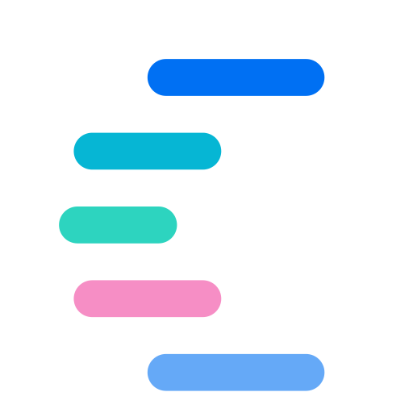
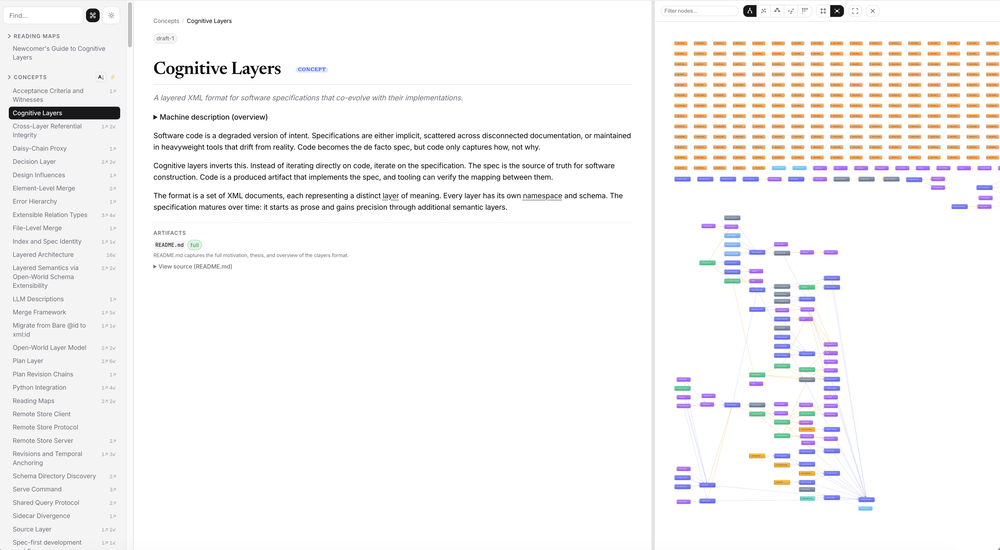

<p align="center">
  
</p>

<p align="center">
  
  <strong>by Inferal</strong>
</p>

<h1 align="center">clayers</h1>

<p align="center">
  <strong>A structured knowledge base your AI agents can actually use.</strong><br>
  Not another pile of markdown files. A layered, schema-validated, content-addressed<br>
  specification format with machine-verifiable traceability to code.
</p>

<p align="center">
  <a href="https://crates.io/crates/clayers"></a>
  <a href="https://pypi.org/project/clayers/"></a>
  <a href="https://github.com/CognitiveLayers/clayers/actions/workflows/ci.yml"></a>
  <a href="LICENSE"></a>
</p>

---

## Why clayers?

AI agents working with your codebase deserve better than grepping through scattered
docs. Clayers gives them a **structured knowledge model** where every concept has a
definition, every definition links to implementing code, and every link is
machine-verified against content hashes.

**For AI/LLM tooling builders** - Your agents get XPath-queryable specifications
with typed layers (prose, terminology, relations, plans) instead of unstructured
text. Every node carries an LLM description layer purpose-built for machine
consumption.

**For teams fighting documentation drift** - Content hashes on both sides (spec
and code) mean drift is detected automatically, not discovered during an
incident. Run `clayers artifact --drift` in CI and know immediately when specs
and code diverge.

**For spec-first developers** - Write the spec, implement the code, map one to
the other. Coverage analysis tells you what's specified but unbuilt, what's built
but unspecified, and what's drifted since last review.

## See it in action

`clayers doc` generates a single-file knowledge explorer from any spec, with
navigable concepts, artifact coverage badges, inline code fragments, and an
interactive knowledge graph:

<p align="center">
  
</p>

## Quick start

```bash
# Install via Cargo
cargo install clayers

# Or via pip (includes CLI)
pip install clayers

# Bootstrap clayers in your project
clayers adopt .

# Validate your specification
clayers validate clayers/my-project/

# Check for drift between spec and code
clayers artifact --drift clayers/my-project/

# Generate browsable documentation
clayers doc clayers/my-project/
```

## How it works

A clayers spec is a set of XML documents. Each document can mix content from
independent **layers**, each with its own namespace and schema. Layers are
orthogonal: editing prose doesn't require touching artifact mappings.

The layer model is **open**: clayers ships with a set of built-in layers, but
anyone can define new ones. Add a namespace, write a schema, and your custom
layer works alongside the built-ins with full validation, querying, and
tooling support.

**Built-in layers:**

| Layer | What it captures |
|-------|-----------------|
| **Prose** | Technical writing: sections, paragraphs, steps, notes |
| **Terminology** | Controlled vocabulary with canonical definitions |
| **Organization** | Topic typing: concept, task, reference |
| **Relation** | Typed semantic links: depends-on, refines, implements |
| **Plan** | Implementation plans with acceptance criteria and witnesses |
| **Artifact** | Bidirectional code traceability with content-hash drift detection |
| **LLM** | Machine-readable descriptions optimized for agent consumption |
| **Decision** | Decision records with status and rationale |
| **Source** | External references and citations |
| **Revision** | Named snapshots for temporal anchoring |

All layers share a common ID space enforced by the index. Nodes reference each
other by ID across files and layers. Custom layers participate in the same ID
space and can reference or be referenced by any built-in layer.

## Key features

### Drift detection

Both spec nodes and code ranges carry SHA-256 content hashes. When either side
changes, `--drift` catches it:

```
$ clayers artifact --drift clayers/my-project/
drift: my-project (23 mappings, 1 drifted)

  map-auth-handler: ARTIFACT DRIFTED
    file: src/auth/handler.rs:42-98
    stored:  sha256:d4ca047eaa97...
    current: sha256:abc123def456...
```

### Coverage analysis

See what's specified but unbuilt, and what's built but unspecified:

```bash
clayers artifact --coverage clayers/my-project/
clayers artifact --coverage clayers/my-project/ --code-path src/
```

### Connectivity analysis

Graph metrics across your knowledge model: density, hubs, bridges, isolated
nodes, cycles.

```bash
clayers connectivity clayers/my-project/
```

### XPath queries

Query the assembled spec as a structured knowledge base:

```bash
# Find a term's definition
clayers query '//trm:term[@id="term-drift"]/trm:definition' clayers/my-project/ --text

# Locate code implementing a concept
clayers query '//art:mapping[art:spec-ref/@node="auth-flow"]/art:artifact/@path' clayers/my-project/

# Get the LLM description for a node
clayers query '//llm:node[@ref="auth-flow"]' clayers/my-project/ --text
```

### Content-addressed version control

A purpose-built VCS that understands XML structure. Documents are decomposed
into a Merkle DAG of XML Infoset nodes, enabling structural diffs,
element-level deduplication, and meaningful merge operations.

```bash
clayers init
clayers add *.xml
clayers commit -m "initial specification"
clayers checkout -b feature-auth
# ... edit, commit, merge ...
clayers merge main --strategy auto
```

### Remote collaboration

Push and pull specs over WebSocket. One server hosts multiple named
repositories with per-user authentication and daisy-chain proxying.

```bash
clayers serve init --repo myspec:/path/to/myspec.db -o server.yaml
clayers serve run server.yaml
clayers clone ws://server:9100/myspec --token <token>
```

## Architecture

Four Rust crates, each with a clear responsibility:

```
crates/
  clayers-xml/     XML utilities: C14N, content hashing, OASIS catalog, RNC export
  clayers-repo/    Content-addressed Merkle DAG with async SQLite storage
  clayers-spec/    Spec-aware tooling: validation, drift, coverage, connectivity
  clayers/         CLI combining spec and repository commands
```

Storage is a single `.clayers.db` SQLite file per repository.

## Python bindings

The `clayers` PyPI package provides the full CLI plus a Python API via PyO3:

```bash
pip install clayers
clayers validate clayers/my-project/
```

## Commands

<details>
<summary><strong>Spec commands</strong></summary>

| Command | Description |
|---------|-------------|
| `validate <path>` | Validate spec structure and cross-layer references |
| `artifact <path>` | List artifact mappings |
| `artifact --drift <path>` | Detect spec/code drift via content hashes |
| `artifact --coverage <path>` | Analyze spec-to-code coverage |
| `artifact --fix-node-hash <path>` | Recompute spec-side hashes |
| `artifact --fix-artifact-hash <path>` | Recompute code-side hashes |
| `connectivity <path>` | Graph metrics: density, hubs, bridges, cycles |
| `schema [path]` | Export XSD schemas as RELAX NG Compact |
| `query <path> <xpath>` | XPath query against assembled spec |
| `doc <path>` | Generate HTML documentation |
| `adopt [path]` | Bootstrap clayers in a project |

</details>

<details>
<summary><strong>Repository commands</strong></summary>

| Command | Description |
|---------|-------------|
| `init [path]` | Create a new repository (`.clayers.db`) |
| `init --bare <path>` | Create a bare repository (no working copy) |
| `clone <source> [target]` | Clone from local path or `ws://` URL |
| `add <files...>` | Stage files for commit |
| `rm <files...>` | Stage deletion |
| `status` | Show staged, modified, and untracked files |
| `commit -m <msg>` | Record staged changes |
| `log [-n N]` | Show commit history |
| `branch [name]` | List or create branches |
| `checkout <branch>` | Switch branches |
| `merge <branch>` | Three-way merge with strategy selection |
| `remote add <name> <url>` | Add a remote |
| `push [remote]` | Push to a remote |
| `pull [remote]` | Pull from a remote |
| `serve run <config>` | Start a WebSocket repository server |
| `serve init` | Generate a server config |
| `query <xpath>` | XPath query against repository |
| `diff` | Show structural diff between commits |
| `revert <files...>` | Restore files to committed state |

</details>

## Development

```bash
cargo build --workspace
cargo test --workspace
cargo install --path crates/clayers
```

## Links

- [Website](https://claye.rs)
- [Changelog](CHANGELOG.md)
- [License](LICENSE) (Apache-2.0)

---

<p align="center">
  Built by <a href="https://inferal.com"><strong>Inferal</strong></a>
</p>
